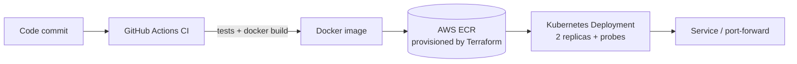
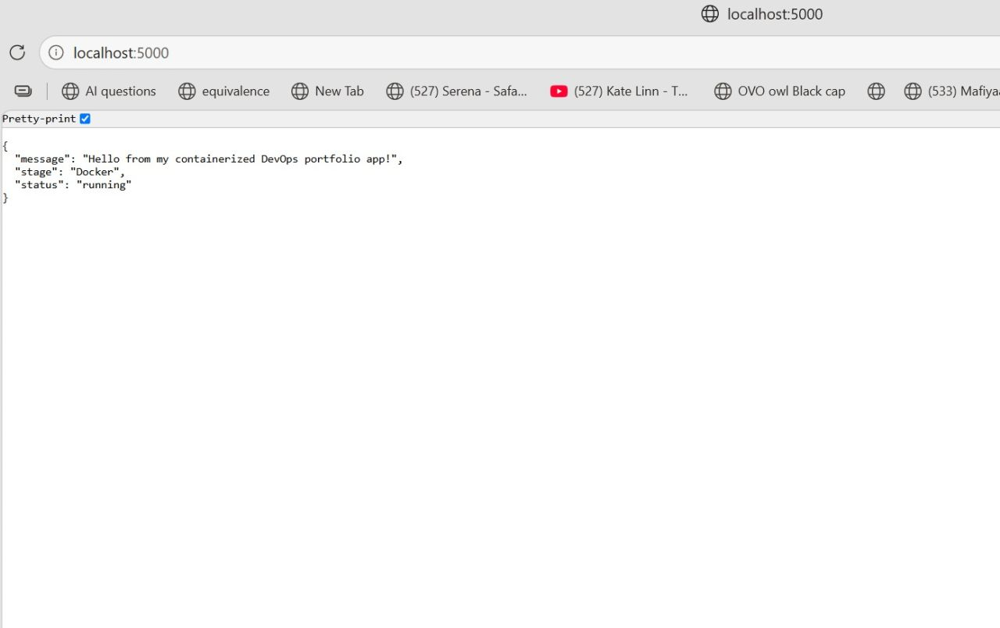

# Containerized App on AWS — Terraform, Docker & Kubernetes

A small Python (Flask) web service taken end to end: containerized with Docker, its image registry provisioned on AWS as Infrastructure as Code with Terraform, then deployed to Kubernetes with health checks, resource limits, and a GitHub Actions CI pipeline.

> **Why this project:** to practise the full path a real service takes — *write code → containerize → provision cloud infra as code → deploy to Kubernetes → automate with CI → tear down cleanly.*

---

## Architecture



## Tech stack

| Area | Tools |
|------|-------|
| App | Python, Flask (status + health routes) |
| Container | Docker |
| Cloud / IaC | AWS ECR, Terraform |
| Orchestration | Kubernetes (kind), Deployments, Services, probes |
| CI/CD | GitHub Actions |

## What it does

- Flask app exposes `/` (status) and `/health` (readiness/liveness) routes.
- Docker packages the app into a portable image.
- **Terraform** provisions an AWS ECR repository as code (versioned, repeatable).
- **Kubernetes** runs the image with **2 replicas**, readiness/liveness probes on `/health`, and CPU/memory requests and limits.
- **GitHub Actions** runs a 4-stage pipeline on every commit: unit tests → Docker build → Kubernetes manifest validation → push.

## Demo



*Two replicas running and healthy on the Kubernetes cluster.*

## Run it locally

```bash
# 1. Build & test the container
docker build -t myapp .
docker run -p 5000:5000 myapp        # visit http://localhost:5000/health

# 2. Provision AWS ECR with Terraform
terraform init
terraform plan
terraform apply

# 3. Deploy to Kubernetes (kind)
kubectl apply -f k8s/
kubectl get pods
kubectl port-forward svc/myapp 8080:80

# 4. Clean up (avoid AWS charges)
terraform destroy
```

## What I learned / what it proves

- Provisioning cloud resources as code with Terraform, including diagnosing and fixing a real **IAM permissions error** that blocked image pushes.
- Running a resilient workload on Kubernetes (self-healing pods, health probes, resource limits).
- Building an automated CI pipeline and practising **cost hygiene** by tearing down all AWS resources after testing.

## Cleanup

`terraform destroy` removes all provisioned AWS resources so nothing keeps billing.
